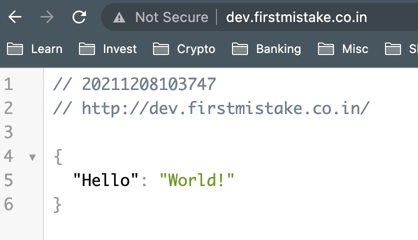
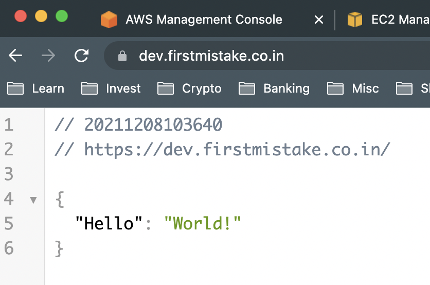

# Bridge-Learning: HTTPS - TLS

# TLS 
Transport Layer Security (TLS), the successor of the now-deprecated Secure Sockets Layer (SSL), is a cryptographic protocol designed to provide communications security over a computer network. The protocol is widely used in applications such as email, instant messaging, and voice over IP, but its use in securing HTTPS remains the most publicly visible.

In Layman terms,
1. When one tries to access a website via browser or makes a REST API call, with http protocol alone, the data being exchanged, is in plaintext form and any third party could easily interecpt this request and misuse the information or lead to data breach or security issues etc.,

2. To solve this problem, we have SSL/TLS that are wrappers around http. Here too, the data is being exchanged but it is encrypted. This means, if there's a third party snooping around, even if they get hold of the entire request, they wouldn't be able to read the information as it is in encrypted format.

This makes for standard for exchanging information across the web securely.  

Here's what I tried:

## Steps:

 1. Created:
    1. EC2 with ```user_data``` to install docker and run a docker container with host ports 80 and 443 forwarded to port 5000 of the container
    2. ALB, Target Group, attached the EC2 instance to TG, created 2 listeners,
        1. port 80 listener forwarding to TG
        2. port 443 listener with SSL cert forwarding to TG
 2. Making request to API with http
 ```
 ➜  ~ curl -v http://dev.firstmistake.co.in
*   Trying 35.154.58.77:80...
* Connected to dev.firstmistake.co.in (35.154.58.77) port 80 (#0)
> GET / HTTP/1.1
> Host: dev.firstmistake.co.in
> User-Agent: curl/7.77.0
> Accept: */*
> 
* Mark bundle as not supporting multiuse
< HTTP/1.1 200 OK
< Date: Wed, 08 Dec 2021 04:45:50 GMT
< Content-Type: application/json
< Content-Length: 24
< Connection: keep-alive
< Server: Werkzeug/2.0.1 Python/3.8.10
< 
{
  "Hello": "World!"
}
* Connection #0 to host dev.firstmistake.co.in left intact
 ```
 

 3. Making request with https
 ```
 ➜  ~ curl -v https://dev.firstmistake.co.in
*   Trying 35.154.58.77:443...
* Connected to dev.firstmistake.co.in (35.154.58.77) port 443 (#0)
* ALPN, offering h2
* ALPN, offering http/1.1
* successfully set certificate verify locations:
*  CAfile: /etc/ssl/cert.pem
*  CApath: none
* TLSv1.2 (OUT), TLS handshake, Client hello (1):
* TLSv1.2 (IN), TLS handshake, Server hello (2):
* TLSv1.2 (IN), TLS handshake, Certificate (11):
* TLSv1.2 (IN), TLS handshake, Server key exchange (12):
* TLSv1.2 (IN), TLS handshake, Server finished (14):
* TLSv1.2 (OUT), TLS handshake, Client key exchange (16):
* TLSv1.2 (OUT), TLS change cipher, Change cipher spec (1):
* TLSv1.2 (OUT), TLS handshake, Finished (20):
* TLSv1.2 (IN), TLS change cipher, Change cipher spec (1):
* TLSv1.2 (IN), TLS handshake, Finished (20):
* SSL connection using TLSv1.2 / ECDHE-RSA-AES128-GCM-SHA256
* ALPN, server accepted to use h2
* Server certificate:
*  subject: CN=firstmistake.co.in
*  start date: Nov 20 00:00:00 2021 GMT
*  expire date: Dec 19 23:59:59 2022 GMT
*  subjectAltName: host "dev.firstmistake.co.in" matched cert's "*.firstmistake.co.in"
*  issuer: C=US; O=Amazon; OU=Server CA 1B; CN=Amazon
*  SSL certificate verify ok.
* Using HTTP2, server supports multi-use
* Connection state changed (HTTP/2 confirmed)
* Copying HTTP/2 data in stream buffer to connection buffer after upgrade: len=0
* Using Stream ID: 1 (easy handle 0x123010600)
> GET / HTTP/2
> Host: dev.firstmistake.co.in
> user-agent: curl/7.77.0
> accept: */*
> 
* Connection state changed (MAX_CONCURRENT_STREAMS == 128)!
< HTTP/2 200 
< date: Wed, 08 Dec 2021 04:51:01 GMT
< content-type: application/json
< content-length: 24
< server: Werkzeug/2.0.1 Python/3.8.10
< 
{
  "Hello": "World!"
}
* Connection #0 to host dev.firstmistake.co.in left intact
 ```



Source: obviously Wikipedia 🤣